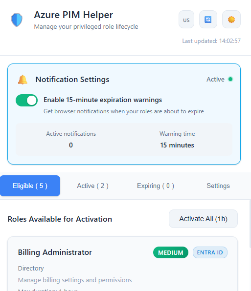
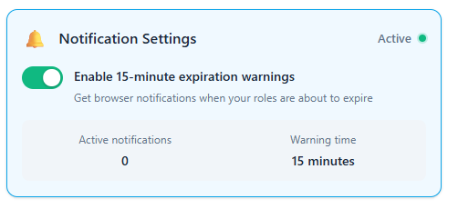
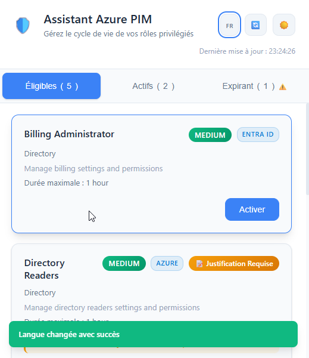
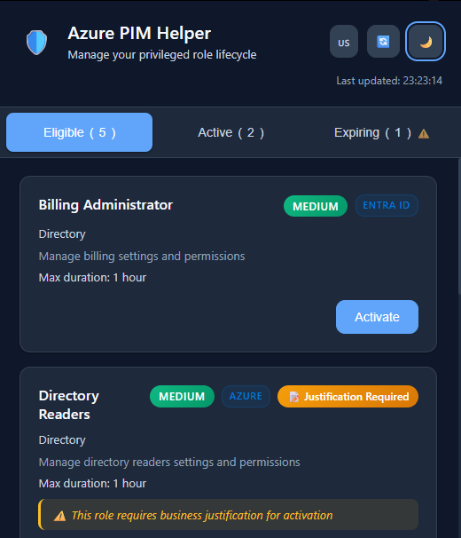
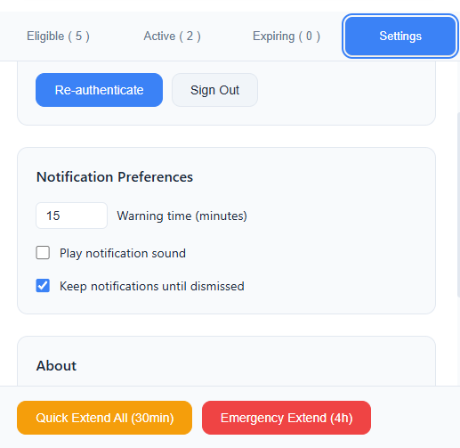

# 🛡️ Azure PIM Helper

<div align="center">


**A beautiful, fast, and intuitive Chrome extension for managing Azure Privileged Identity Management roles with proactive expiration notifications**

[](https://chrome.google.com/webstore)
[](https://graph.microsoft.com)
[](https://developer.mozilla.org/en-US/docs/Web/JavaScript)

*Made with ❤️ from Tunisia by **Layth CHEBBI** 🇹🇳*

[Features](#-features) • [Installation](#-installation) • [Usage](#-usage) • [Screenshots](#-screenshots) • [Contributing](#-contributing)

---

</div>

## ✨ Features

### 🚀 **Lightning Fast Performance**
- **Parallel API calls** for instant role loading
- **Smart caching** with 1-hour role definition cache
- **Optimized rendering** with document fragments
- **Background service worker** for seamless experience

### 🔔 **Proactive Expiration Notifications** ⭐ *NEW!*
- **15-minute browser notifications** before role expiration
- **Real-time monitoring** of active role lifecycles
- **One-click role extension** directly from notifications
- **Smart notification management** with automatic cleanup
- **Emergency extension options** for critical situations

### 🎨 **Beautiful & Modern UI**
- **520px responsive design** for comfortable viewing
- **Dark/Light/System themes** with smooth transitions
- **Professional gradients** and modern styling
- **Enhanced tabbed interface** (Eligible • Active • Expiring • Settings)
- **Toast notifications** for non-intrusive feedback

### 🌐 **Multi-Language Support**
- **English/French language switcher** with flag icons 🇺🇸/🇫🇷
- **Real-time language switching** without page reload
- **Persistent language preferences** saved locally
- **Complete UI translation** including dynamic content
- **Browser language auto-detection** on first use

### 🔐 **Advanced Security Features**
- **Azure AD integration** with PKCE authentication
- **Implicit OAuth flow** for maximum compatibility
- **Real-time justification detection** from Azure PIM policies
- **Role-based access indicators** (Critical • High • Medium)

### ⚡ **Smart Role Management**
- **One-click activation** with automatic justification
- **Role extension** for active assignments
- **Bulk operations** for multiple roles ⭐ *NEW!*
- **Emergency extensions** with confirmation dialogs ⭐ *NEW!*
- **Service categorization** (Azure • Entra ID • Microsoft 365)

### 🎯 **Intelligent Justification Detection**
- **Azure PIM Policy API integration** for accurate detection
- **Real-time policy analysis** of `EndUser/Assignment` rules
- **Automatic justification text** based on role requirements
- **Visual justification badges** only when actually required
- **No false positives** - reads your actual Azure configuration

### ⚙️ **Comprehensive Settings** ⭐ *NEW!*
- **Notification preferences** with customizable warning times
- **Authentication management** with re-auth and sign-out options
- **Sound notification controls** and persistence settings
- **About section** with version and feature information

### 🏷️ **Enhanced Visual Indicators**
- **📝 Justification Required** tags for compliance roles
- **⚠️ Expiring Soon** alerts for time-sensitive roles
- **🔒 Critical Role** badges for high-privilege access
- **Real-time status updates** with live countdowns
- **🔔 Notification status** indicators throughout the interface

---

## 🎯 Role Categories

<div align="center">

| Service | Badge | Examples |
|---------|-------|----------|
| **Azure** |  | Owner, Contributor, Key Vault Administrator |
| **Entra ID** |  | Global Administrator, Security Administrator |
| **Microsoft 365** |  | Exchange Administrator, SharePoint Administrator |

</div>

---

## 🔔 Notification System

The extension features a comprehensive notification system to prevent unexpected role expiration:

### 📱 **Browser Notifications**
- **15-minute warnings** before role expiration
- **Interactive buttons** for quick actions (Extend/Dismiss)
- **Automatic reactivation** for expired roles
- **Visual and audio alerts** (configurable)

### 🎛️ **Notification Controls**
- **Toggle switch** to enable/disable monitoring
- **Real-time status indicators** showing active/inactive state
- **Active notification counter** displaying current alerts
- **Customizable warning time** (1-60 minutes)

### 🚨 **Emergency Actions**
- **Quick Extend All** - 30-minute extension for expiring roles
- **Emergency Extend** - 4-hour extension for all active roles
- **Bulk operations** with confirmation dialogs
- **One-click role management** from notifications

---

## 🌐 Language Support

The extension supports both **English** and **French** with seamless switching:

### 🇺🇸 English Interface
- Native English UI with cybersecurity terminology
- Professional business language for enterprise use
- Complete feature coverage including notifications

### 🇫🇷 Interface Française
- Interface utilisateur complète en français
- Terminologie de cybersécurité appropriée
- Support complet des notifications d'expiration

**Language Switching:**
- Click the 🌐 flag icon in the header to switch languages
- Your preference is automatically saved
- All UI elements update instantly, including:
  - Button labels and tooltips
  - Status messages and notifications
  - Role information and error messages
  - Time formats and dynamic content

---

## 📸 Screenshots

<div align="center">

### 🌟 Main Interface with Notifications
*Elegant role management with proactive expiration alerts*



### 🔔 Notification Settings Panel ⭐ *NEW!*
*Comprehensive notification control and preferences*



### 🌐 Multi-Language Support
*Seamless language switching with flag icons*



### 📝 Intelligent Justification Detection
*Real-time Azure PIM policy analysis*



### ⚙️ Enhanced Settings Tab ⭐ *NEW!*
*Complete control over authentication and preferences*



### 🌙 Dark Theme with Notifications
*Beautiful dark mode with notification support*


</div>

---

## 🚀 Installation

### Prerequisites
- Google Chrome or Chromium-based browser
- Azure AD account with PIM-eligible roles
- Azure AD application registration with appropriate permissions

### Quick Start

1. **Clone the repository**
   ```bash
   git clone https://github.com/laythchebbi/azure-pim-helper.git
   cd azure-pim-helper
   ```

2. **Configure Azure AD App**
   ```javascript
   // Update CLIENT_ID and TENANT_ID in background.js
   const CONFIG = {
     CLIENT_ID: 'your-client-id-here',
     TENANT_ID: 'your-tenant-id-here',
     // ...
   };
   ```

3. **Create the localization structure**
   ```
   your-extension/
   ├── _locales/
   │   ├── en/
   │   │   └── messages.json
   │   └── fr/
   │       └── messages.json
   ├── manifest.json
   ├── popup.html
   ├── popup.css
   ├── popup.js
   └── background.js
   ```

4. **Load in Chrome**
   - Open `chrome://extensions/`
   - Enable "Developer mode"
   - Click "Load unpacked"
   - Select the project folder

5. **Grant Notification Permission** ⭐ *NEW!*
   - Allow browser notifications when prompted
   - Configure notification preferences in Settings tab

6. **Authenticate & Enjoy!** 🎉

---

## 🎮 Usage

### 📋 **View Eligible Roles**
Browse your PIM-eligible roles with detailed information including max duration, scope, and service categorization.

### ⚡ **Quick Activation**
Click the "Activate" button to instantly activate roles with appropriate justification handling.

### ⏰ **Monitor Active Roles**
Track your active role assignments with real-time expiration countdowns and extension options.

### 🔔 **Proactive Notifications** ⭐ *NEW!*
- **Enable notifications** via the toggle in the notification panel
- **Receive browser alerts** 15 minutes before role expiration
- **Take action directly** from notifications (Extend/Dismiss)
- **Monitor multiple roles** simultaneously with smart management

### 🚨 **Emergency Management** ⭐ *NEW!*
- **Quick Extend All** - Extend expiring roles by 30 minutes
- **Emergency Extend** - Extend all active roles by 4 hours
- **Bulk Activate** - Activate multiple eligible roles at once
- **Bulk Extend** - Extend multiple active roles simultaneously

### ⚙️ **Settings Management** ⭐ *NEW!*
- **Authentication control** - Re-authenticate or sign out
- **Notification preferences** - Customize warning times and sounds
- **About information** - View version and feature details

### 🌐 **Language Switching**
Use the flag icon (🇺🇸/🇫🇷) in the header to instantly switch between English and French interfaces.

### 📝 **Smart Justification**
The extension automatically detects which roles require justification by:
- Querying your actual Azure PIM policies via Microsoft Graph API
- Analyzing `EndUser/Assignment` enablement rules  
- Checking for "Justification" in the `enabledRules` array
- Displaying accurate justification badges only when needed

---

## 🛠️ Technical Architecture

### 📦 **Extension Structure**
```
azure-pim-helper/
├── 📄 manifest.json          # Extension configuration with notifications
├── 🎨 popup.html             # Enhanced UI with notification panel
├── 💅 popup.css              # Beautiful styling with notification themes
├── ⚡ popup.js               # Frontend logic with notification controls
├── 🔧 background.js          # Service worker with notification system
├── 🌐 _locales/              # Internationalization files
│   ├── en/messages.json      # English translations (enhanced)
│   └── fr/messages.json      # French translations (enhanced)
└── 🎯 icons/                 # Extension icons (48px for notifications)
```

### 🔔 **Notification System Architecture** ⭐ *NEW!*
```javascript
// Real-time role expiration monitoring
class NotificationManager {
  startMonitoring(graphClient) {
    // Check every minute for role expirations
    this.monitoringInterval = setInterval(() => {
      this.checkRoleExpirations(graphClient);
    }, 60000);
  }

  async createExpirationWarning(role, expirationDate, minutesUntilExpiration) {
    await chrome.notifications.create(notificationId, {
      type: 'basic',
      iconUrl: 'icons/icon-48.png',
      title: '⚠️ Azure Role Expiring Soon',
      message: `Your "${roleName}" role will expire in ${timeText}`,
      buttons: [
        { title: 'Extend Role' },
        { title: 'Dismiss' }
      ],
      requireInteraction: true,
      priority: 2
    });
  }
}
```

### 🔗 **API Integration**
- **Microsoft Graph v1.0** for role management
- **OAuth 2.0 Implicit Flow** for authentication
- **Role Management APIs** for PIM operations
- **Policy Management APIs** for justification detection
- **Chrome Notifications API** for browser alerts ⭐ *NEW!*

### 🎯 **Enhanced Justification Detection System**
```javascript
// Real-time Azure PIM policy analysis
const policyEndpoint = `/policies/roleManagementPolicyAssignments?$filter=scopeId eq '/' and roleDefinitionId eq '${roleId}'`;
const policyData = await this.makeRequest(policyEndpoint);

// Analyze EndUser Assignment enablement rules
const enablementRule = policy.rules.find(rule => 
  rule['@odata.type'] === '#microsoft.graph.unifiedRoleManagementPolicyEnablementRule' &&
  rule.target?.caller === 'EndUser' && 
  rule.target?.level === 'Assignment'
);

const requiresJustification = enablementRule?.enabledRules?.includes('Justification');
```

### 🚀 **Performance Optimizations**
- **Parallel API calls** for concurrent data loading
- **Smart caching** with expiration management
- **Document fragments** for efficient DOM updates
- **Debounced operations** for smooth interactions
- **Embedded translations** for instant language switching
- **Efficient notification management** with cleanup and deduplication ⭐ *NEW!*

---

## 🎨 Customization

### 🔔 **Notification Configuration** ⭐ *NEW!*
```javascript
// Customize notification behavior in NotificationManager
const CONFIG = {
  checkIntervalMinutes: 1,    // Check frequency (1-60 minutes)
  warningTimeMinutes: 15,     // Warning time (1-60 minutes)
  requireInteraction: true,   // Keep notifications until dismissed
  priority: 2                 // High priority notifications
};
```

### 🌐 **Adding New Languages**
To add support for additional languages:

1. **Create new locale folder**
   ```bash
   mkdir _locales/es  # For Spanish
   ```

2. **Add complete messages.json** (including notification messages)
   ```json
   {
     "extName": {
       "message": "Asistente Azure PIM",
       "description": "Nombre de la extensión"
     },
     "notificationSettings": {
       "message": "Configuración de notificaciones",
       "description": "Título del panel de notificaciones"
     }
     // ... add all message translations
   }
   ```

3. **Update embedded translations**
   ```javascript
   // In popup.js getLanguageMessages()
   const messages = {
     en: { /* English messages */ },
     fr: { /* French messages */ },
     es: { /* Spanish messages */ }  // Add new language
   };
   ```

### 🎯 **Justification Configuration**
The extension automatically detects justification requirements from Azure PIM policies. No manual configuration needed!

### 🎨 **Theme Customization**
Modify CSS variables to match your organization's branding:

```css
:root {
  --accent-color: #your-brand-color;
  --bg-primary: #your-background;
  --text-primary: #your-text-color;
  --notification-bg: #your-notification-background;
  --notification-border: #your-notification-border;
}
```

---

## 🔒 Security & Permissions

### Required Azure AD Permissions
- `RoleManagement.ReadWrite.Directory`
- `PrivilegedAccess.ReadWrite.AzureResources`
- `RoleAssignmentSchedule.ReadWrite.Directory`
- `Directory.Read.All`
- `Policy.Read.All` or `RoleManagementPolicy.Read.Directory`

### Required Chrome Permissions ⭐ *NEW!*
- `notifications` - For browser notification alerts
- `alarms` - For precise timing of notification checks
- `storage` - For saving notification preferences
- `activeTab` - For popup interaction

### 🛡️ Security Features
- **PKCE authentication** for secure token exchange
- **Token caching** with automatic expiration
- **Minimal permissions** principle
- **Secure storage** of authentication data
- **Read-only policy access** for justification detection
- **Safe notification handling** with proper cleanup ⭐ *NEW!*

---

## 🐛 Troubleshooting

### Common Issues

**Authentication Errors**
```bash
# Clear extension storage
chrome.storage.local.clear()
# Reload extension and re-authenticate
```

**Notification Issues** ⭐ *NEW!*
```bash
# Check notification permissions
chrome.notifications.getPermissionLevel()
# Verify notification toggle in extension popup
# Check browser notification settings
```

**Role Loading Issues**
- Verify Azure AD permissions
- Check service worker console for API errors
- Ensure proper tenant and client ID configuration

**Justification Detection Issues**
- Verify `Policy.Read.All` or `RoleManagementPolicy.Read.Directory` permissions
- Check console logs for detailed policy API responses
- Ensure admin consent is granted for policy permissions

**Language Switching Issues**
- Check browser console for translation errors
- Verify `_locales` folder structure is correct
- Clear extension storage if language preference is stuck

**Performance Issues**
- Check for browser extensions conflicts
- Verify network connectivity to Microsoft Graph
- Review console logs for detailed error information
- Disable notification monitoring if experiencing high CPU usage

---

## 🆕 What's New in v2.1

### 🔔 **Proactive Notification System**
- **15-minute browser notifications** before role expiration
- **Interactive notification buttons** for quick role extension
- **Real-time monitoring** with automatic cleanup
- **Emergency extension options** for critical situations
- **Customizable notification preferences** in Settings tab

### ⚙️ **Enhanced Settings Management**
- **Complete Settings tab** with authentication controls
- **Notification preferences** with sound and persistence options
- **Re-authentication** and sign-out functionality
- **About section** with version and feature information

### 🚀 **Bulk Operations & Quick Actions**
- **Bulk Activate** - Activate multiple eligible roles (max 5)
- **Bulk Extend** - Extend multiple active roles simultaneously
- **Quick Extend All** - 30-minute emergency extension
- **Emergency Extend** - 4-hour extension for all active roles

### 🎨 **UI/UX Improvements**
- **Toast notification system** for non-intrusive feedback
- **Dynamic button visibility** based on available actions
- **Enhanced status indicators** throughout the interface
- **Improved error handling** with specific recovery options

### 🌐 **Expanded Multi-Language Support**
- **Enhanced French translations** for all new features
- **Complete notification localization** in both languages
- **Settings and bulk action translations** added
- **Improved language switching** performance

---

## 🤝 Contributing

We welcome contributions from the community! Here's how you can help:

### 🚀 **Development Setup**
1. Fork the repository
2. Create a feature branch
3. Make your changes
4. Test thoroughly (including notification system)
5. Submit a pull request

### 📝 **Contribution Guidelines**
- Follow existing code style and conventions
- Add comprehensive comments for complex logic
- Test all features across different role types
- Update documentation for new features
- Test language switching and translations
- Test notification system thoroughly ⭐ *NEW!*

### 🎯 **Areas for Contribution**
- 🌍 **Additional language support** (Spanish, German, etc.)
- 🔔 **Enhanced notification features** (custom sounds, rich notifications)
- 🔍 **Advanced justification detection** algorithms
- 🎨 **Additional themes** and customization options
- 📊 **Analytics and reporting** features
- 🔧 **Performance optimizations**
- 📱 **Mobile support** improvements

---

## 📈 Roadmap

### 🎯 **Upcoming Features**
- [ ] 🌍 **Additional languages** (Spanish, German, Portuguese)
- [ ] 📊 **Role usage analytics** and reporting dashboard
- [ ] 🔔 **Rich notifications** with custom sounds and images
- [ ] 📱 **Mobile-responsive design** improvements
- [ ] 🔄 **Advanced bulk operations** with filtering
- [ ] 📋 **Role assignment history** and audit logs
- [ ] 🎨 **Custom theme builder** with organization branding
- [ ] 🔗 **Integration with Microsoft Teams** and other services
- [ ] 🤖 **AI-powered role recommendations** based on usage patterns
- [ ] 📈 **Advanced PIM policy analytics** and compliance reporting

### ✅ **Recently Completed (v2.1)**
- [x] 🔔 **Proactive notification system** with 15-minute warnings
- [x] ⚙️ **Enhanced Settings tab** with comprehensive controls
- [x] 🚀 **Bulk operations** for efficient role management
- [x] 🎨 **Toast notification system** for better UX
- [x] 🌐 **Expanded multi-language support** with notification localization

### ✅ **Previously Completed (v2.0)**
- [x] 🌐 **Multi-language support** (English/French)
- [x] 📝 **Intelligent justification detection** from Azure PIM policies
- [x] 🎨 **Enhanced UI/UX** with better visual indicators
- [x] 🔧 **Improved error handling** and debugging capabilities

---

## 📄 License

This project is licensed under the MIT License - see the [LICENSE](LICENSE) file for details.

---

## 🙏 Acknowledgments

- **Microsoft Graph Team** for excellent API documentation
- **Azure PIM Team** for the powerful role management platform
- **Chrome Extensions Team** for the robust extension platform and notification APIs
- **Open Source Community** for inspiration and best practices
- **International contributors** for translation and localization support
- **Security professionals** who provided feedback on notification security

---

## 🌟 Support

If you find this project helpful, please consider:

- ⭐ **Starring the repository** on GitHub
- 🐛 **Reporting bugs** and suggesting features
- 💡 **Contributing** to the codebase
- 📢 **Sharing** with your colleagues and community
- 🌍 **Contributing translations** for new languages
- 🔔 **Testing the notification system** and providing feedback

---

<div align="center">

### 🇹🇳 Made with ❤️ from Tunisia by **Layth CHEBBI**

**Cybersecurity Engineer & Azure Specialist**  
*Building world-class security tools for the global Azure community*

[](https://github.com/laythchebbi)
[](https://linkedin.com/in/laythchebbi)
[](mailto:layth.chebbi@email.com)

[Report Bug](https://github.com/laythchebbi/azure-pim-helper/issues) • [Request Feature](https://github.com/laythchebbi/azure-pim-helper/issues) • [Documentation](https://github.com/laythchebbi/azure-pim-helper/wiki)

---

*Azure PIM Helper v2.1 - Simplifying privileged access management, one role at a time.*  
*Now with intelligent multi-language support, real-time policy detection, and proactive expiration notifications!*


[](https://github.com/laythchebbi/azure-pim-helper/stargazers)
[](https://github.com/laythchebbi/azure-pim-helper/network)

</div>